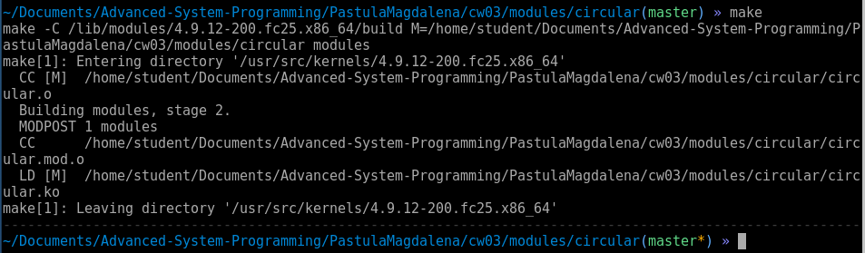

## Programowanie Systemowe
## Laboratorium nr 3 - Tworzenie modułów
### Magdalena Pastuła

### Zadanie 1 - obsługa pamięci.

W tym zadaniu wykonano wszystkie podpunkty. W przypadku intefejsu do realokacji buforu w folderze `/proc` przed użyciem należy najpierw zmienić jego prawa dostępu. Domyślnie można z niego tylko czytać.

W przypadku wypisywania informacji z urządzenia `/dev/circular` po przejściu zapisu na początek bufora wypisuje się również na sam koniec znak `%`. Nie znaleziono przyczyny takiego zachowania.

Logi wypisywane w konsoli w czasie kompilacji modułu:

### Zadanie 2. - Zaawansowany moduł.

Tak samo jak w poprzednim zadaniu, komunikaty wypisywane podczas czytania z urządzeń posiadają na końcu znak `%`. Nie znaleziono przyczyny takiego zachowania.

Logi wypisywane w czasie kompilacji modułu:

### Zadanie 3. - Backdoor.

To zadanie nie zostało wykonane.