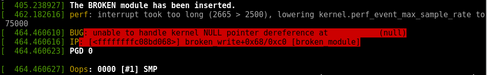

## Programowanie Systemowe
## Laboratorium 4 - Debugowanie jądra
### Magdalena Pastuła

## Zadanie 1 - debugowanie modułów.

### Moduł nr 1

Poniżej znajduje się screen części informującej o błędzie przez Oops:


Natomiast następny screen to dalszy ciąg komunikatów z Oops:


Jak można zauważyć, błąd sygnalizowany przez Oops to problem z dostępem do strony w pamięci przestrzeni jądra. Na drugim screenie RIP podpowiada, że błąd wystąpił przy użyciu funkcji kfree pod adresem 0x170 w segmencie 0x53, a z zapisów Call trace można wyczytać, że błąd wystąpił w module broken_module w funkcji broken_read. Poniżej znajduje się kod funkcji, w której wystąpił błąd.

```C
ssize_t broken_read(struct file *filp, char *user_buf, size_t count,
	loff_t *f_pos)
{
	char *mybuf = NULL;
	int mybuf_size = 100;
	int len, err;

	mybuf = kmalloc(mybuf_size, GFP_KERNEL);
	if (!mybuf) {
		return -ENOMEM;
	}

	fill_buffer(mybuf, mybuf_size);

	len = strlen(mybuf);
	err = copy_to_user(user_buf, mybuf, len);
	kfree(user_buf);

	read_count++;

	if (!err && *f_pos == 0) {
		*f_pos += len;
		return len;
	}
	return 0;
}
```

Po przeanalizowaniu kodu okazuje się, że błędem jest próba zwolnienia pamięci z przestrzeni użytkownika, do której procesy z przestrzeni jądra nie mają bezpośredniego dostępu, co wyjaśnia problem z dostępem do pamięci zgłoszony w Oops. Po zmianie fragmentu `kfree(user_buf)` na `kfree(mybuf)` moduł już działa poprawnie i nie zgłasza żadnych błędów. Poniżej znajduje się screen komunikatów jądra po załadowaniu wykonaniu podanych instrukcji i usunięciu poprawionego modułu, a także screen komunikatu po wywołaniu komendy 'cat /dev/broken`.


### Moduł nr 2

Poniżej znajduje się screeny przedstawiające komunikaty Oops po załadowaniu i uruchomieniu modułu drugiego.


Podobnie jak w poprzednim module, w tym również błąd pojawił się w funkcji `broken_read` oraz `fill_buffer`, jednakże tym razem sygnalizowanym błędem jest problem w dereferencji wskaźnika. Poniżej znajduje się kod funkcji `broken_read` oraz `fill_buffer`.

```C
int fill_buffer(char *buf, int buf_size)
{
	sprintf(mybuf, "I've created a buffer of size: %d\n", buf_size);
	return strlen(mybuf);
}

ssize_t broken_read(struct file *filp, char *user_buf, size_t count,
	loff_t *f_pos)
{
	char *buf;
	int buf_size = 100;
	int len, err;

	buf = kmalloc(buf_size, GFP_KERNEL);
	if (buf == 0) {
		return -ENOMEM;
	}
	fill_buffer(buf, buf_size);

	len = strlen(buf);
	err = copy_to_user(user_buf, buf, len);
	kfree(buf);

	read_count++;


	if (!err && *f_pos == 0) {
		*f_pos += len;
		return len;
	}
	return 0;
}
```

Jak widać, sama funkcja `broken_read` nie zawiera żadnego błędu pod względem referencji do niezaalokowanego wskaźnika. Natomiast sytuacja taka ma miejsce w funkcji `fill_buffer`, która do funkcji sprintf jako argument przekazuje globalny wskaźnik `mybuf`, który jest niezaalokowany, zamiast przekazanego argumentu. Również linijkę niżej do funkcji strlen jako argument przekazany jest zły wskaźnik.

Po poprawieniu błędu i ponownym uruchomieniu modułu otrzymujemy komunikaty wypisywane po wywołaniu komend `dmesg` i `cat /dev/broken` są takie same jak w poprzednim zadaniu.

### Moduł nr 3

Poniżej znajduje się screeny przedstawiające komunikaty Oops po załadowaniu i uruchomieniu modułu drugiego.


W tym przypadku błąd sugerowany przez Oops to dereferencja wskaźnika równego `NULL` podczas użycia funkcji `strcpy` w funkcji `broken_write` i `fill_buffer_with_process_name`. Poniżej znajduje się kod tych dwóch funcji.

```C
void fill_buffer_with_process_name(long pid)
{
	struct pid *selected_pid = find_get_pid(pid);
	struct task_struct *selected_proc = pid_task(selected_pid, PIDTYPE_PID);

	if (selected_proc != NULL)
		strcpy(buf1, (char *) selected_proc->pid);
	else
		sprintf(buf1, "The process with PID: %ld cannot be found", pid);
}

ssize_t broken_write(struct file *filp, const char *buf, size_t count,
		     loff_t *f_pos)
{
	int error = 0;
	long pid = 0;
	int copy_size = count;

	if (count > buf1_size)
		copy_size = buf1_size - 1;

	error = copy_from_user(buf1, buf, copy_size);
	buf1[copy_size] = 0;

	pid = simple_strtol(buf1, buf1 + copy_size, 10);

	if (pid < 1)
		printk(KERN_WARNING "Invalid PID number\n");
	else
		fill_buffer_with_process_name(pid);

	write_count++;
	return copy_size;
}
```

Jak widać, błąd znajduje się w funkcji `fill_buffer_with_process_name` przy użyciu funkcji `strcpy`: podany jako drugi argument pid jest liczbą całkowitą, a nie napisem, zatem po rzutowaniu na wskaźnik na char otrzymujemy wskaźnik na niekontrolowany fragment pamięci. Ponieważ przekazany pid był równy 2, to program próbuje dostać się do adresu równego 2, co widać w komunikacie Oops.

### Moduł nr 4

Poniżej znajduje się screeny przedstawiające komunikaty Oops po załadowaniu i uruchomieniu modułu drugiego.


W przypadku tego modułu Oops zwraca informację, że nastąpił błąd w pliku `usercopy.c`, co może oznaczać, że wystąpił błąd podczas kopiowania danych z przestrzeni użytkownika. Dodatkowo, błąd miał się pojawić w funkcji `broken_write`. Poniżej znajduje się kod tej funkcji.

```C
ssize_t broken_write(struct file *filp, const char *user_buf, size_t count,
	loff_t *f_pos)
{
	char *mybuf = NULL;
	int mybuf_size = 100;
	int real_count = count;
	int err;

	// Initialize the memory
	kmalloc(mybuf_size, GFP_KERNEL);

	// Take the max(mybuf_size, count)
	if (real_count > mybuf_size)
		real_count = mybuf_size;

	// Copy the buffer from user space
	err = copy_from_user(mybuf, user_buf, real_count);
	mybuf[mybuf_size] = 0;

	if (!err && real_count > 0) {
		// Count number of digits in buffer
		numbers_count = count_numbers(mybuf);
	} else {
		printk(KERN_WARNING "BROKEN: error occured in write function");
	}

	// Free the memory
	if (mybuf != NULL)
		kfree(mybuf);

	write_count++;
	return real_count;
}
```

Po przeanalizowaniu tego kodu okazuje się, że faktycznie nastąpił tu błąd. Wprawdzie używana jest funkcja kmalloc, ale jej wynik jest ignorowany, zatem wskaźnik mybuf przekazany do funkcji kopiowania z przestrzeni użytkownika jest równy `NULL`. Po poprawieniu tego błędu i ponownym 
uruchowieniu modułu otrzymujemy następujące komunikaty Oops:




Okazało się, że w module znajduje się następny błąd w funkcji `count_numbers`, której kod znajduje się poniżej. Ponownie występuje tutaj odwołanie się do wskaźnika, który jest równy `NULL` i który nie jest przekazanym argumentem.

```C
int count_numbers(char *str)
{
        int numbers = 0;
        char *ptr = 0;

        while (*ptr != 0) {
                ptr++;
		if (isdigit(*ptr))
                        numbers++;
        }

        return numbers;
}
```

Po naprawieniu tego błędu moduł działał już poprawnie.

## Zadanie 2 - GDB.

### Urządzenie `/proc/loadsvg`

### Urządzenie `/proc/PID/fd`

### Urządzenie `/proc/PID/environ`

