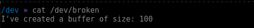

## Programowanie Systemowe
## Laboratorium 4 - Debugowanie jądra
### Magdalena Pastuła

## Zadanie 1 - debugowanie modułów.

### Moduł nr 1

Poniżej znajduje się screen części informującej o błędzie przez Oops:


Natomiast następny screen to dalszy ciąg komunikatów z Oops:


Jak można zauważyć, błąd sygnalizowany przez Oops to problem z dostępem do strony w pamięci przestrzeni jądra. Na drugim screenie RIP podpowiada, że błąd wystąpił przy użyciu funkcji kfree pod adresem 0x170 w segmencie 0x53, a z zapisów Call trace można wyczytać, że błąd wystąpił w module broken_module w funkcji broken_read. Poniżej znajduje się kod funkcji, w której wystąpił błąd.

```C
ssize_t broken_read(struct file *filp, char *user_buf, size_t count,
	loff_t *f_pos)
{
	char *mybuf = NULL;
	int mybuf_size = 100;
	int len, err;

	mybuf = kmalloc(mybuf_size, GFP_KERNEL);
	if (!mybuf) {
		return -ENOMEM;
	}

	fill_buffer(mybuf, mybuf_size);

	len = strlen(mybuf);
	err = copy_to_user(user_buf, mybuf, len);
	kfree(user_buf);

	read_count++;

	if (!err && *f_pos == 0) {
		*f_pos += len;
		return len;
	}
	return 0;
}
```

Po przeanalizowaniu kodu okazuje się, że błędem jest próba zwolnienia pamięci z przestrzeni użytkownika, do której procesy z przestrzeni jądra nie mają bezpośredniego dostępu, co wyjaśnia problem z dostępem do pamięci zgłoszony w Oops. Po zmianie fragmentu `kfree(user_buf)` na `kfree(mybuf)` moduł już działa poprawnie i nie zgłasza żadnych błędów. Poniżej znajduje się screen komunikatów jądra po załadowaniu wykonaniu podanych instrukcji i usunięciu poprawionego modułu, a także screen komunikatu po wywołaniu komendy 'cat /dev/broken`.




### Moduł nr 2

Poniżej znajduje się screeny przedstawiające komunikaty Oops po załadowaniu i uruchomieniu modułu drugiego.


Podobnie jak w poprzednim module, w tym również błąd pojawił się w funkcji `broken_read` oraz `fill_buffer`, jednakże tym razem sygnalizowanym błędem jest problem w dereferencji wskaźnika. Poniżej znajduje się kod funkcji `broken_read` oraz `fill_buffer`.

```C
int fill_buffer(char *buf, int buf_size)
{
	sprintf(mybuf, "I've created a buffer of size: %d\n", buf_size);
	return strlen(mybuf);
}

ssize_t broken_read(struct file *filp, char *user_buf, size_t count,
	loff_t *f_pos)
{
	char *buf;
	int buf_size = 100;
	int len, err;

	buf = kmalloc(buf_size, GFP_KERNEL);
	if (buf == 0) {
		return -ENOMEM;
	}
	fill_buffer(buf, buf_size);

	len = strlen(buf);
	err = copy_to_user(user_buf, buf, len);
	kfree(buf);

	read_count++;


	if (!err && *f_pos == 0) {
		*f_pos += len;
		return len;
	}
	return 0;
}
```

Jak widać, sama funkcja `broken_read` nie zawiera żadnego błędu pod względem referencji do niezaalokowanego wskaźnika. Natomiast sytuacja taka ma miejsce w funkcji `fill_buffer`, która do funkcji sprintf jako argument przekazuje globalny wskaźnik `mybuf`, który jest niezaalokowany, zamiast przekazanego argumentu. Również linijkę niżej do funkcji strlen jako argument przekazany jest zły wskaźnik.

Po poprawieniu błędu i ponownym uruchomieniu modułu otrzymujemy komunikaty wypisywane po wywołaniu komend `dmesg` i `cat /dev/broken` są takie same jak w poprzednim zadaniu.

### Moduł nr 3


### Moduł nr 4


## Zadanie 2 - GDB.

